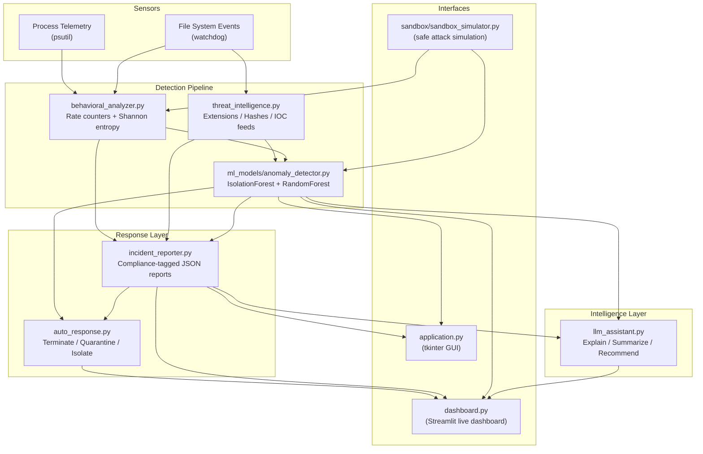

# Architecture — AI-Augmented Ransomware Detection Platform

This document describes the extended architecture after integrating ML-based
anomaly detection, an LLM security assistant, a real-time Streamlit dashboard,
a sandbox simulator, and an automated response engine on top of the original
five-layer detection pipeline.

## High-level component diagram

## Component responsibilities

**Sensors.** `ransomware_monitor.py` uses `watchdog` for recursive file
system observation and `psutil` for process inspection, feeding raw events
into the behavioral analyzer.

**Detection pipeline.** `threat_intelligence.py` performs signature-style
checks (extensions, SHA-256 hashes, custom IOC feeds). `behavioral_analyzer.py`
maintains sliding-window counters (modify/rename/delete/create rates) and
computes Shannon entropy to flag encryption-like activity. `ml_models/anomaly_detector.py`
adds a statistical layer on top: an unsupervised `IsolationForest` flags
telemetry that deviates from learned-normal behavior, while a supervised
`RandomForestClassifier` estimates the probability that a given behavioral
snapshot matches ransomware patterns. The two scores are blended into a single
0–100 risk score.

**Intelligence layer.** `llm_assistant.py` consumes structured telemetry,
ML assessments, and incident JSON to produce natural-language explanations,
incident narratives, and prioritized mitigation recommendations. It runs
fully offline via deterministic templates when no LLM API key is configured,
and upgrades to a real LLM call when `LLM_API_KEY` is set.

**Response layer.** `auto_response.py` exposes three narrowly-scoped,
dry-run-by-default actions: process termination, file quarantine (move, never
delete), and network adapter isolation. `incident_reporter.py` remains the
system of record for compliance-tagged incident JSON.

**Interfaces.** The original `application.py` tkinter GUI continues to work
unchanged. `dashboard.py` adds a browser-based Streamlit view for live
telemetry, ML risk scoring, incident browsing, and one-click sandbox
simulation. `sandbox/sandbox_simulator.py` generates safe, synthetic
ransomware-like behavior (no real malware or cryptography) purely to validate
end-to-end detection accuracy.

## Data flow summary

1. File and process events are captured by the sensors.
2. `behavioral_analyzer.py` and `threat_intelligence.py` compute rates,
   entropy, and signature matches.
3. `ml_models/anomaly_detector.py` scores the resulting feature vector.
4. High-severity events produce a structured incident report
   (`incident_reporter.py`).
5. The LLM assistant can be invoked on demand (from the GUI, dashboard, or
   CLI) to explain the event, summarize the incident, or recommend
   mitigations.
6. If configured for live enforcement, `auto_response.py` can terminate the
   offending process, quarantine affected files, and/or isolate the host's
   network adapters.
7. All of the above is visualized in real time in `dashboard.py`.

## Trust boundaries and safety defaults

* `auto_response.py` defaults every action to `dry_run=True`. Live
  enforcement requires an explicit, deliberate configuration change by the
  operator.
* `sandbox/sandbox_simulator.py` only ever creates/modifies files inside its
  own `logs/sandbox/<run_id>/` directory and cleans up after itself.
* `llm_assistant.py` only transmits structured behavioral metadata to an
  external LLM API if one is explicitly configured — file contents and PII
  are never included in prompts, and no external calls are made unless
  `LLM_API_KEY` is set.
